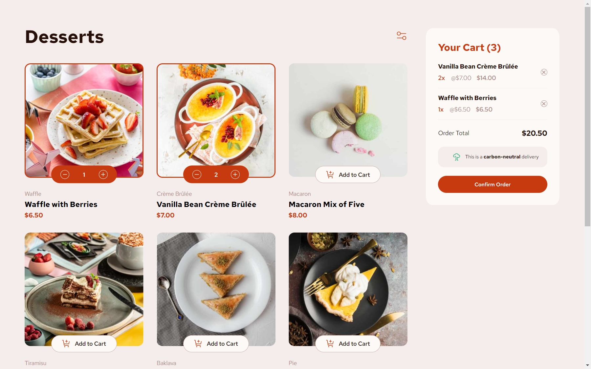
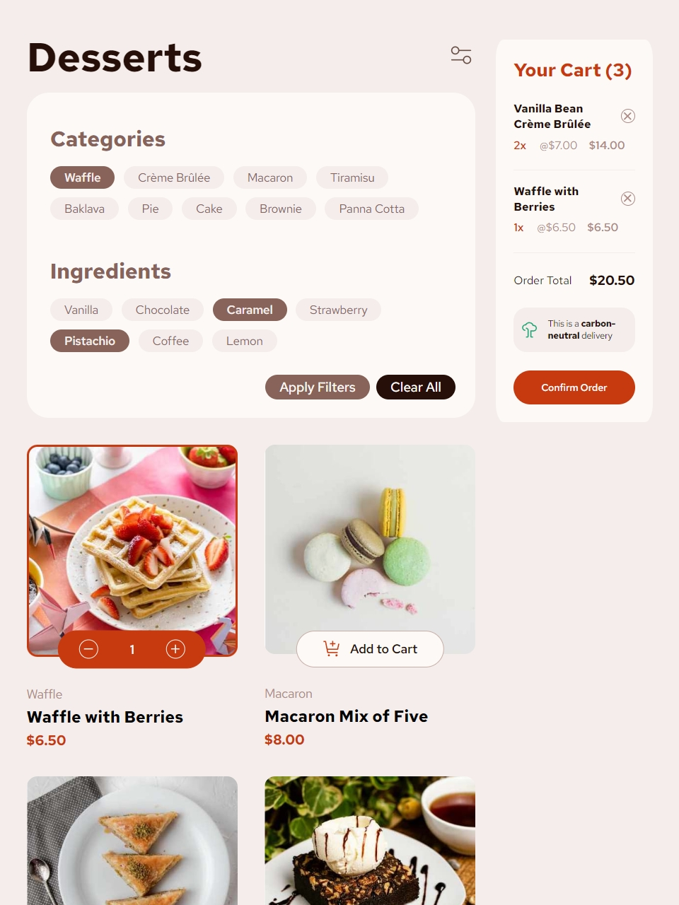
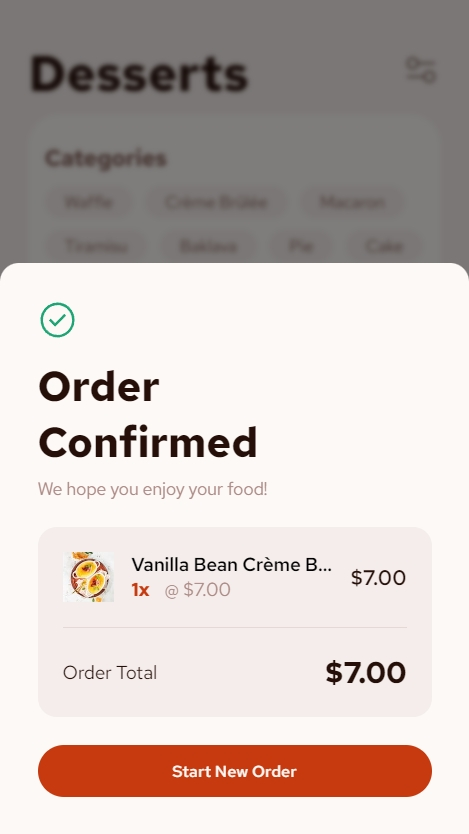

# Frontend Mentor - Product list with cart solution

This is a solution to the [Product list with cart challenge on Frontend Mentor](https://www.frontendmentor.io/challenges/product-list-with-cart-5MmqLVAp_d). Frontend Mentor challenges help you improve your coding skills by building realistic projects.

## Table of contents

- [Overview](#overview)
  - [Screenshot](#screenshot)
- [My process](#my-process)
  - [Built with](#built-with)

## Overview

Users should be able to:

- Filter items, add them to the cart and remove them
- Increase/decrease the number of items in the cart
- See an order confirmation modal when they click "Confirm Order"
- Reset their selections when they click "Start New Order"
- View the optimal layout for the interface depending on their device's screen size
- See hover and focus states for all interactive elements on the page

### Screenshot

## My process

I'm really proud of how my SCSS skills have evolved. I’m much quicker now, and whenever I run into a styling challenge, I can find a solution fast, which keeps my workflow steady.

With React, I feel confident handling core tasks like data fetching and state management. I know there's always room to grow, but I’m proud of how I’ve handled the complexity of this project :D .

### Built with

- React
- SCSS / Sass
- Json
- Vite
- BEM Methodology
- Vercel
